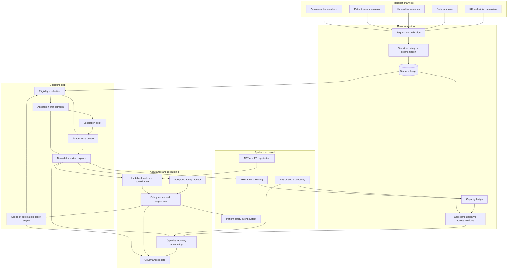

# Panelward

**Source:** `ai-in-health/Accenture-Chart-AI-Can-Address-Demand/`
**Domain:** `ai-health`
**One-liner:** A clinical demand-and-capacity system for health systems that measures the care requests which never became encounters, classifies which of them may be safely absorbed by automated or lower-licence channels under ratified clinical policy, and proves the recovered clinician minutes against payroll.
**Wedge:** Multi-site ambulatory medical groups of 300–1,200 employed clinicians in access-constrained specialties — primary care, behavioural health, dermatology, endocrinology — where the access centre, the patient portal inbox, and the referral queue are already overflowing and locums spend is the only lever in use.
**Positioning:** A demand-side capacity system, not a staffing or scheduling tool. Workforce planning tools model the supply curve and access tools compress the template; both scale cost with demand. Panelward instruments the demand curve at request level, treats "which requests may be absorbed without a clinician minute" as a governed clinical policy decision rather than a product feature, and makes the absorbed share auditable in both directions — capacity recovered and misses detected.

## Market research synthesis

### Thesis from source

The source is a single illustrative exhibit on US clinicians. It plots two diverging curves from 2016 through 2021 to 2026 — clinician demand rising faster than clinician supply — and labels the widening wedge between them "20% Estimated Unmet Demand Addressable via AI." It is explicit that the graph is not to scale and is illustrative, and it attributes the estimate to Accenture analysis.

Three things that exhibit establishes precisely, and they are more useful than the headline. First, the deficit is framed as structural and decade-long rather than cyclical: the curves diverge across three time points, so the gap is not a hiring-cycle artefact that a recruitment push closes. Second, the quantity on the chart is *unmet demand*, not vacancies, unfilled shifts, or turnover. That is a different object entirely — it is demand that never converts into a clinical encounter, and it is therefore invisible in the systems that count encounters. Third, the addressable fraction is bounded at one fifth, which necessarily asserts that four fifths is not addressable this way. A bounded fraction turns the problem from a capability question into a *classification* question: the operational difficulty is not building an automated channel, it is knowing reliably which unit of demand belongs in it.

What the exhibit deliberately does not supply is any denominator a health system could manage against. There is no absolute clinician count, no specialty breakdown, no geography below "US", and by the source's own admission no scale. A chief clinical officer cannot run an access programme against a national illustrative wedge. The product implication is that the twenty percent must be treated as a hypothesis to be earned locally and measured, never as a benchmark to be assumed: the system has to measure this group's demand, this group's available capacity, and this group's audited absorption rate, then report the gap it actually closed.

The hard part follows from where unmet demand physically lives. An electronic health record is a ledger of encounters that happened; a request that failed to convert leaves no encounter row. The evidence of unmet demand is scattered across the access centre's telephony platform as abandoned calls and queue overflow, the patient portal as messages answered late or never, the scheduling system as appointment searches that returned no slot inside the clinically appropriate window, referral management as authorisations that expired before a visit, emergency registration as patients who left without being seen, and pharmacy data as chronic-disease refills that lapsed. Until those are unified into one request-level ledger, a health system cannot state its own unmet demand, let alone claim to have reduced it. Everything else in the product — eligibility policy, absorption channels, safety surveillance, recovered-capacity accounting — hangs off that ledger.

The safety argument runs in the opposite direction with equal force. Absorbing a request that genuinely needed a clinician is a delayed-diagnosis event, and absorbing it disproportionately for one language group, one payer class, or one age band is a health-equity failure with regulatory exposure attached. A responsible reading of the exhibit is therefore not "automate a fifth of demand" but "prove, cohort by cohort and with a look-back window, which fifth was safe to absorb, and stop when the evidence says otherwise."

### Buyer & economic model

- **Primary buyer:** Chief Clinical Officer or Chief Medical Officer of a multi-site medical group, co-sponsored by the VP of Ambulatory Operations who owns access performance; the Chief Nursing Officer co-signs where nurse time is the constrained resource.
- **Users:** patient access agents and triage nurses (continuous), clinic managers and access supervisors (daily), panel-owning physicians and advanced practice providers (daily review of what happened to their patients), the clinical governance and patient-safety committee (policy ratification and incident review), the health equity officer (subgroup audits), workforce planning and finance analysts (capacity reconciliation).
- **Budget owner / value metric:** the clinical labour and patient-access budget. The value metric is recovered clinician minutes per week converted into a documented access outcome — third-next-available appointment days, referral turnaround, left-without-being-seen rate, portal message turnaround — with contribution margin on recaptured visits as the finance-facing translation.
- **Competing status quo:** locum and travel staffing, overtime and incentive shifts, template compression and double-booking, a centralised access centre working from static protocol scripts, and an unmeasured symptom checker bolted onto the portal. All of these either add cost proportional to demand or produce deflection nobody measures. The nearest credible competitor is a nurse triage line, which is trusted precisely because a licensed human dispositions every call — and expensive for the same reason.

### Domain constraints

- **Regulatory / trust / safety:** any function that renders an acuity or triage disposition can meet the definition of a regulated clinical decision support device, so every automated behaviour must be classified against the device criteria — whether the recommendation is time-critical, whether the basis is independently reviewable by the clinician, whether it drives diagnosis or treatment selection — and functions that fall inside the device boundary must operate under a clearance and its intended-use conditions. State scope-of-practice and licensure rules govern who may dispose of a request at all, and cross-state telehealth licensure limits where an absorbed request may be resolved. A named accountable clinician must remain attached to every disposition. Mis-triage and delayed-diagnosis events must flow into the patient-safety event system, and for device-classified functions into post-market surveillance and malfunction reporting. Nondiscrimination obligations attaching to patient-care decision support tools make documented subgroup performance monitoring and a written risk-mitigation plan a condition of operation rather than a nice-to-have.
- **Data sensitivity:** a care request is protected health information before any encounter exists, so the demand ledger is a PHI system from the first row. Access-centre staff must operate under minimum-necessary scoping rather than seeing whole charts. Portal messages and call transcripts routinely contain heightened-confidentiality content — behavioural health, substance use, reproductive health, HIV status, gender identity — which cannot be routed through general queues or exposed to automated handling on the same terms as a rash photograph. Capacity analytics look de-identified but re-identify easily at the cell sizes that matter operationally: one clinician, one small clinic, one rare specialty on one day.
- **Change-management realities:** panel-owning physicians read absorption as loss of continuity, and under fee-for-service also as loss of work relative value units, so the compensation consequence must be answered before the clinical one is debated. Nurses read it as inbox work moved onto them. Medical staff bylaws, collective agreements, and nurse-to-patient ratio rules constrain workload changes. Access centres run 30–50% annual agent turnover, so nothing may depend on agent expertise. Policies must be ratifiable by a committee that meets monthly and suspendable by a single safety officer within hours.

## Business requirements

- BR-1: Unmet clinical demand must be measured as care requests that did not convert into a clinically appropriate encounter inside a specialty-specific access window, reported weekly at site, specialty, and panel level; demand the system cannot see may not be counted as demand, and demand the system did not measure before an intervention may not later be claimed as recovered.
- BR-2: No request may be absorbed by an automated or lower-licence channel unless it falls inside a scope-of-automation policy ratified by the clinical governance committee for that specialty, naming an accountable clinician, stating the exclusion criteria, and carrying an expiry date after which it must be re-ratified or lapses closed.
- BR-3: Every absorbed request must carry an escalation path with a maximum time-to-clinician defined by the policy, and any breach of that time must open a safety review automatically rather than waiting for a complaint.
- BR-4: Absorption and escalation performance must be reported by demographic subgroup — age band, sex, race and ethnicity, preferred language, payer class, disability status, and geography — and a disparity beyond the governance-set threshold must suspend the affected policy automatically, not merely generate a report.
- BR-5: Recovered capacity must be expressed in clinician minutes by role and converted into an access outcome the organisation already reports externally, so that the claim is legible to boards and regulators without a proprietary index.
- BR-6: Claimed recovered minutes must be reconciled against payroll, scheduled sessions, and productivity records, and the system must disclose when recovered minutes were reabsorbed by other work rather than converted into additional access — an honest zero is a required output.
- BR-7: Continuity of care must be preserved: every absorbed request must be written back to the owning panel's record, and any disposition that changed a care plan, started a medication, or advised a symptom watch must reach the panel clinician within one business day.
- BR-8: Every absorbed request must be followed for a specialty-specific look-back window for downstream escalation — unplanned emergency visit, admission, or new serious diagnosis — and the resulting miss rate must be published to governance on a fixed cadence whether or not it is favourable.
- BR-9: Patients must be able to decline automated handling and reach a human without penalty or degraded wait time, and the availability of that path may not be narrowed to hit an absorption target; requests carrying heightened-confidentiality content must default to human handling.
- BR-10: The commercial case must be stated separately for each payment regime: under fee-for-service, visit volume and contribution margin recaptured; under capitated or value-based contracts, avoided low-value utilisation and closed care gaps. The system must not recommend absorption that removes reimbursable work without a compensating contractual benefit.
- BR-11: Policy ratifications, threshold changes, model version changes, and suspensions must be retained as an evidentiary record sufficient for an accreditation survey, a regulator, or a malpractice discovery request, with the state of policy at the moment of any historical disposition reconstructable.
- BR-12: Any clinician or staff member must be able to flag a disposition as unsafe in a single step, and flagged patterns must enter the next governance review with a named owner and a deadline, so that front-line dissent has a route that does not depend on goodwill.

## User stories

Canonical user stories live in sibling [USER_STORIES.md](USER_STORIES.md).

## System design

### Overview

Panelward runs two loops that meet at a policy. The measurement loop unifies care requests from telephony, portal, scheduling, referral, and registration systems into a request-level demand ledger, sets each request against the specialty's access-window standard and the site's available capacity, and computes an unmet-demand figure that is defensible because it names the requests it counted. The operating loop evaluates each live request against the ratified scope-of-automation policy for its specialty and clinical category, routes eligible requests to an automated or lower-licence channel with an attached escalation clock, records a named accountable disposition, writes the outcome back to the panel's record, and then follows the patient for a look-back window to detect whether absorption was in fact safe. Surveillance, subgroup audit, and capacity accounting all read from the same dispositions, which is what allows the recovered-minutes claim and the miss-rate claim to be reported from one source instead of two competing decks.

### Actors & boundaries

- **Actors:** the patient making a request, access agents and triage nurses, panel-owning clinicians, clinic and access managers, the clinical governance committee, the patient-safety officer, the health equity officer, workforce and finance analysts, and the platform administrator.
- **Trust boundary:** the ratified policy is the boundary object. Automated channels may act only inside a policy; the policy engine cannot be edited by the teams whose targets it constrains; and the suspension control is held by clinical safety, not by operations. Patient-identifiable request content stays inside the covered-entity boundary, with access-centre roles scoped to the minimum fields needed to route rather than to the chart. Heightened-confidentiality categories are segmented at ingestion, before any eligibility evaluation runs.
- **Human-in-the-loop points:** policy ratification and re-ratification; per-panel and per-patient exclusions set by the owning clinician; triage nurse disposition of every escalated request; safety review of every escalation-clock breach; adjudication of flagged dispositions; sign-off of each capacity recovery statement by both operations and finance.

### Core capabilities

1. **Demand ledger** — request-level capture and normalisation of care requests across telephony, portal messaging, scheduling searches, referrals, and registration, including the requests that failed to convert, with clinical category assignment.
2. **Capacity ledger** — available clinician minutes by role, site, specialty, and session, net of leave, administrative time, and template blocks, so that supply is a measured quantity rather than a headcount.
3. **Gap computation** — unmet demand per site, specialty, and panel against access-window standards, with the counted population and exclusions stated on the face of the result.
4. **Scope-of-automation policy engine** — ratified, versioned, expiring policies defining which clinical categories may be absorbed by which channel, with exclusion criteria, escalation limits, accountable clinician, and suspension controls.
5. **Eligibility evaluation** — per-request decision against active policy, patient preference, panel exclusions, licensure and jurisdiction constraints, and sensitive-category segmentation.
6. **Absorption orchestration** — routing to automated or lower-licence channels, escalation clocks, and mandatory named disposition capture.
7. **Safety net and escalation** — breach detection, immediate reroute to human handling, and automatic safety-review creation.
8. **Outcome surveillance** — look-back monitoring of absorbed requests for downstream emergency visits, admissions, and new serious diagnoses, producing a published miss rate.
9. **Subgroup equity monitor** — continuous absorption, escalation, and miss-rate comparison across demographic cohorts with automatic policy suspension on threshold breach.
10. **Capacity recovery accounting** — recovered minutes by role reconciled to payroll and session data, translated into access outcomes and into contract-appropriate financial value.
11. **Governance and evidentiary record** — ratifications, suspensions, model versions, thresholds, flags, and adjudications retained so that historical policy state is reconstructable.

### Conceptual data

- **Primary entities:** DemandRequest, ClinicalCategory, AccessWindowStandard, CapacitySnapshot, ClinicianProfile, PanelAssignment, GapMeasurement, AutomationPolicy, PolicyRatification, EligibilityDecision, AbsorptionDisposition, EscalationEvent, SurveillanceOutcome, SafetySignal, SubgroupPerformance, PatientAutomationPreference, CapacityRecoveryStatement, GovernanceReview.
- **Critical events:** request captured, request expired unmet, eligibility evaluated, request absorbed, disposition recorded by a named clinician, escalation clock breached, request rerouted to human, downstream escalation detected within look-back, subgroup threshold breached, policy ratified, policy suspended, recovery statement signed.
- **Retention / audit needs:** dispositions, escalations, and the policy state that authorised them retained for the full clinical record and malpractice limitation period with immutable history, because the reconstructable question years later is "what was the patient told, by whom, under what authority." Surveillance outcomes retained long enough to support the look-back window plus trend analysis. Call recordings and message bodies retained on the shortest schedule that supports safety review, with heightened-confidentiality content held under separate segmentation and stricter access logging. Subgroup analytics retained in aggregate with small-cell suppression to prevent re-identification of individual clinicians and patients.

### Integrations (conceptual)

- **Systems of record:** the electronic health record for appointments, slots, service requests, encounters, tasks, and communications; the practice management and scheduling system; the referral management system; the patient portal; the access centre telephony and contact-distribution platform; the patient-safety event reporting system.
- **Upstream signals:** admission-discharge-transfer feeds and emergency registration for downstream escalation detection, payroll and provider productivity systems for the capacity ledger and reconciliation, credentialing and licensure registries for scope and jurisdiction checks, payer contract and attribution files to determine which economic model applies, patient demographic and language data for subgroup monitoring.
- **Downstream actions:** routing instructions to the automated or lower-licence channel, task creation in the clinician inbox for panel notification, appointment booking inside the access window when absorption is refused, escalation tasks to triage, safety event creation, suspension notices to operations, and statement exports to finance and to the governance pack.

### High-level architecture

Measurement is a durable, reconcilable path; absorption is a live path with a clock attached. They are separated so that a request can never be absorbed faster than the policy engine can authorise it, and so that the capacity claim is computed from recorded dispositions rather than from channel telemetry.

### Success metrics

- **Leading:** share of care requests captured in the demand ledger versus estimated total request volume; proportion of absorption running under an in-date ratified policy; median time from escalation trigger to licensed clinician contact; escalation-clock breach rate; subgroup disparity index across absorption and escalation; share of absorbed requests written back to the panel within one business day; patient opt-out rate for automated handling and wait-time parity for those who opt out.
- **Lagging:** measured unmet demand closed per specialty against the source's illustrative twenty percent, stated with confidence bounds; third-next-available appointment days and portal turnaround; downstream miss rate for absorbed requests within the look-back window compared with the nurse-triage baseline; recovered clinician minutes per role reconciled to payroll and the share of them converted into access rather than reabsorbed; referral leakage retained and left-without-being-seen rate; clinician and nurse attrition in participating sites.

## OpenAPI skeleton

Canonical HTTP surface lives in sibling [openapi.yaml](openapi.yaml). Summary:

- **Base path:** `/v1/...`
- **Auth:** `X-API-Key` for system-to-system integration from the EHR, telephony, and ADT feeds; Bearer JWT for console users, whose role determines whether they may ratify, suspend, or only read.
- **Resource groups:** Demand, Capacity, Automation Policies, Absorption, Safety Surveillance, Equity, Recovery Reporting, Governance.
