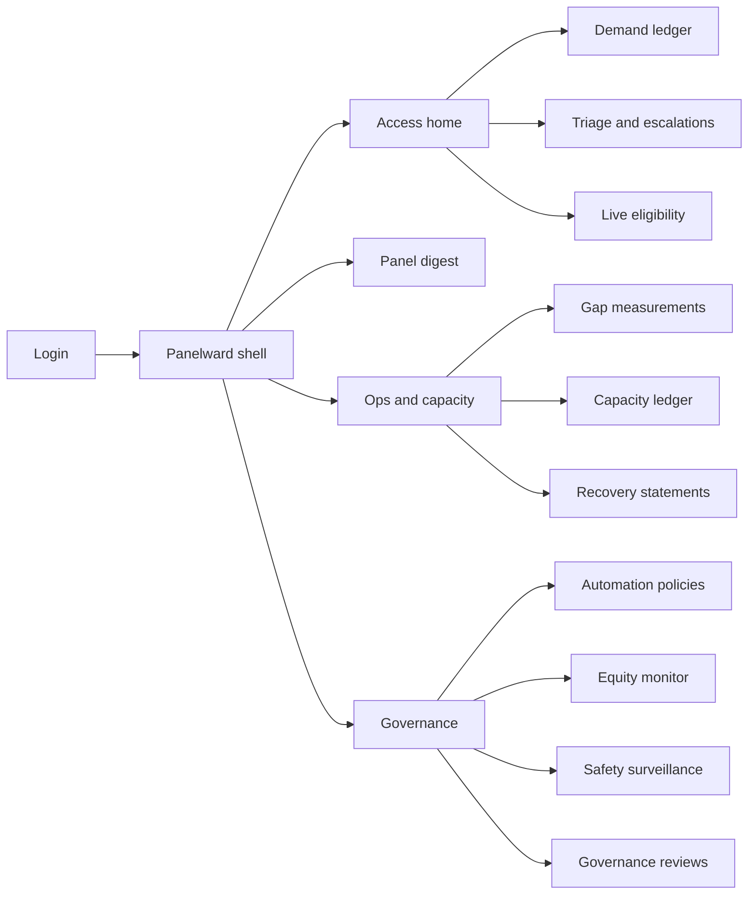
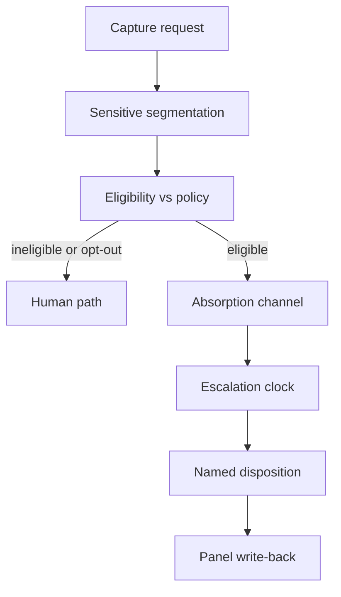

# Panelward — Web app

**Product:** [PRODUCT.md](./PRODUCT.md)
**Primary surface:** Clinical demand-and-capacity console (access ops + governance shell)
**Secondary surfaces:** Panel clinician daily digest (read-focused); capacity recovery statement export (PDF/CSV for finance/board)
**Design thesis:** Panelward is a demand ledger with a clinical policy lock — not a staffing board and not an “AI triage chatbot.” The metaphor is a ward census for requests that never became encounters: every row is a care request with a conversion fate, and absorption only appears when a ratified, expiring policy unlocks it. Visual language is cool clinical steel and access-window amber on a pale clinical ground — recovered minutes feel earned only when payroll-reconciled; suspended policies feel like a hard stop, not a soft warning. The Panelward wordmark sits beside every gap figure so boards know the twenty-percent claim is local evidence, not Accenture’s illustrative wedge.

## UX research synthesis

### Category peers (best-in-class)

- **Epic Cadence / Prelude (access centre):** Request queues with minimum-necessary fields, callback timers, and clear handoff to clinical roles. Steal: agent-first density and one-click escalate; reject chart-dump sidebars that violate minimum-necessary for access staff.
- **Qventus (hospital capacity OS):** Predictive capacity with explicit “why this prediction” and operational actions tied to census. Steal: gap as a first-class object with counted population disclosed on the face; reject OR/ED theatre metaphors for ambulatory request demand.
- **LeanTaaS iQueue:** Specialty-level capacity as minutes and slots, not headcount. Steal: minutes-by-role as the unit of truth and session-level supply; reject elective-surgery optimization aesthetics for unmet portal/phone demand.
- **Kyruus ProviderMatch / Relatient access:** Access-window standards and third-next-available as board-legible outcomes. Steal: specialty-specific windows next to demand; reject consumer “find a doctor” marketing chrome inside the operator console.

### Patterns to adopt / reject

- **Adopt:** Request-level demand ledger as home object; policy ratification with expiry and accountable clinician; escalation clocks with auto safety review; subgroup equity with automatic suspension; recovery statements that can honestly print zero; patient opt-out parity indicators.
- **Reject:** Headcount-only workforce dashboards; chatbot-as-primary UX; vanity “AI absorption score”; editable recovered-minutes totals; purple “insights” panels; absorbing without showing the governing policy version on the disposition.

### Trust, density, and workflow constraints from PRODUCT.md

Access agents cannot improvise clinical decisions (BR-2, BR-9): eligibility must answer before any channel offer. Heightened-confidentiality content defaults to human queues. Equity breaches suspend policy automatically (BR-4) — suspension chrome must be impossible to miss. Capacity claims require dual sign-off and payroll reconciliation (BR-5, BR-6). Continuity write-back and look-back miss rates are governance-grade (BR-7, BR-8, BR-11). Front-line unsafe flags must be one step with visible ownership (BR-12).

## Information architecture

### Nav model

### Roles → default home

| Role | Default home | Why |
|------|--------------|-----|
| Access agent / triage nurse | Access home — open requests + escalations | Continuous disposition work |
| Panel-owning clinician | Panel digest | Continuity and unsafe flags (BR-7, BR-12) |
| Ambulatory ops director | Gap measurements | Site/specialty unmet demand (BR-1) |
| Clinical governance chair | Automation policies | Ratify / expiry / suspend (BR-2, BR-11) |
| Patient-safety officer | Safety surveillance | Miss rate and clock breaches (BR-3, BR-8) |
| Health equity officer | Equity monitor | Subgroup thresholds (BR-4) |
| Workforce / finance analyst | Recovery statements | Payroll-reconciled minutes (BR-5, BR-6, BR-10) |

### Cross-links to OpenAPI resources

| Nav area | OpenAPI tags / resources |
|----------|---------------------------|
| Demand ledger | Demand |
| Capacity, panels, access windows | Capacity |
| Policies, ratification, suspension | Automation Policies |
| Eligibility, dispositions, escalations, flags | Absorption |
| Look-back outcomes, safety signals | Safety Surveillance |
| Subgroup performance | Equity |
| Recovery statements and sign-off | Recovery Reporting |
| Reviews, patient automation preference | Governance |

## Screen inventory

### Access home

- **Purpose:** Answer “what is overflowing right now, and what may I legally absorb?” in one composition.
- **Entry:** Default post-login for access/triage roles.
- **Layout regions:** Brand + site switcher; queue health (abandoned, late portal, expired referrals); policy-in-date indicator; escalations nearing clock; sensitive-category share routed to human.
- **Primary actions:** Open demand ledger; take next triage item; jump to breached clocks.
- **Empty / loading / error:** Empty = healthy queues with last capture timestamp; loading = skeleton queues; error = feed lag banner with request id.
- **BR / story ties:** BR-1, BR-2, BR-9; access agent stories.

### Demand ledger

- **Purpose:** Request-level census of care requests including those that never converted.
- **Entry:** Access or Ops nav → Demand.
- **Layout regions:** Filterable table (site, specialty, channel, conversion state); row detail with clinical category, access window, minimum-necessary patient fields; counted-population footnote on any aggregate.
- **Primary actions:** Open request; evaluate eligibility; mark human-path preference; export week slice for ops.
- **Empty / loading / error:** Empty specialty = “no captured requests — demand may not be claimed”; ingest errors surface per channel.
- **BR / story ties:** BR-1; ops director stories.

### Live eligibility

- **Purpose:** Per-request decision against active policy before any channel offer.
- **Entry:** From demand row or agent workflow.
- **Layout regions:** Policy version + accountable clinician; eligibility outcome; exclusion reasons; licensure/jurisdiction checks; sensitive-category gate; patient opt-out state.
- **Primary actions:** Offer absorption channel; force human path; escalate one-click.
- **Empty / loading / error:** No in-date policy = block absorption with ratify CTA for governance (not for agents).
- **BR / story ties:** BR-2, BR-9; access agent stories.

### Triage and escalations

- **Purpose:** Licensed human disposition of escalated or sensitive requests with reasoning and patient words visible.
- **Entry:** Access home escalations; clock breach alerts.
- **Layout regions:** Priority queue with countdown; case pane (channel transcript/message, automated reasoning if any, panel owner); disposition capture; unsafe-flag control.
- **Primary actions:** Dispose; breach → open safety review; flag unsafe; write-back confirm.
- **Empty / loading / error:** Empty = no open escalations; breach state = coral blocking banner.
- **BR / story ties:** BR-3, BR-7, BR-12; triage nurse stories.

### Panel digest

- **Purpose:** Daily continuity view of what was absorbed for this clinician’s patients.
- **Entry:** Clinician default home.
- **Layout regions:** Yesterday’s absorptions; plan/med/symptom-watch changes due within one business day; panel exclusions editor; recovered-minutes vs schedule reality; unsafe flags filed.
- **Primary actions:** Acknowledge write-backs; exclude patient/situation; flag disposition; open schedule impact.
- **Empty / loading / error:** Empty = “no absorptions on your panel”; lag = write-back overdue amber.
- **BR / story ties:** BR-7, BR-12; panel physician stories.

### Gap measurements

- **Purpose:** Unmet demand vs specialty access windows with counted population on the face.
- **Entry:** Ops home default.
- **Layout regions:** Site × specialty matrix; trend vs local baseline (not national 20% as truth); exclusions list; drill to demand rows.
- **Primary actions:** Set/review access-window standards; export board pack slice; model proposed policy impact.
- **Empty / loading / error:** Pre-baseline period cannot claim recovery (BR-1) — explicit lock on claims.
- **BR / story ties:** BR-1; ops director stories.

### Capacity ledger

- **Purpose:** Available clinician minutes by role/site/specialty/session — supply as measured quantity.
- **Entry:** Ops → Capacity.
- **Layout regions:** Snapshot table; panel assignments; leave/admin/template net-downs; comparison to demand gap.
- **Primary actions:** Record/refresh snapshot; open panel; link to recovery.
- **Empty / loading / error:** Missing payroll feed = capacity marked provisional.
- **BR / story ties:** BR-5, BR-6; capacity capabilities.

### Automation policies

- **Purpose:** Draft, ratify, expire, and suspend scope-of-automation policies.
- **Entry:** Governance home.
- **Layout regions:** Policy list (specialty, channel, expiry, status); editor with exclusion criteria, escalation limits, accountable clinician; ratification record; suspension control.
- **Primary actions:** Draft; ratify; suspend with in-flight reroute; schedule re-ratification.
- **Empty / loading / error:** Expired policy shows closed — no silent extension.
- **BR / story ties:** BR-2, BR-11; governance chair stories.

### Equity monitor

- **Purpose:** Continuous subgroup absorption/escalation/miss comparison with auto-suspend on breach.
- **Entry:** Equity officer default; governance nav.
- **Layout regions:** Cohort grid (age, sex, race/ethnicity, language, payer, disability, geography); threshold markers; small-cell suppression cues; linked suspended policies.
- **Primary actions:** Investigate cohort; confirm suspension; open governance review.
- **Empty / loading / error:** Insufficient N = suppressed cells, not fake zeros.
- **BR / story ties:** BR-4; equity officer stories.

### Safety surveillance

- **Purpose:** Look-back miss rate and safety signals published on a fixed cadence.
- **Entry:** Safety officer default.
- **Layout regions:** Specialty miss-rate panels vs nurse-triage baseline; signal queue; clock-breach reviews; link to patient-safety event system status.
- **Primary actions:** Open signal; assign owner/deadline; suspend related policy.
- **Empty / loading / error:** Favourable rates still publish on cadence (BR-8) — no hide-when-good.
- **BR / story ties:** BR-3, BR-8, BR-12.

### Recovery statements

- **Purpose:** Recovered minutes reconciled to payroll/sessions, translated to access outcomes and contract-appropriate value.
- **Entry:** Finance/workforce home; ops shortcut.
- **Layout regions:** Statement header (period, specialty); minutes by role; reabsorbed-vs-converted disclosure; FFS vs value-based value panes; dual sign-off rail.
- **Primary actions:** Sign-off (ops + finance); export; compare to illustrative 20% with confidence bounds.
- **Empty / loading / error:** Honest zero is a valid signed output (BR-6).
- **BR / story ties:** BR-5, BR-6, BR-10; analyst stories.

### Governance reviews

- **Purpose:** Evidentiary pack for ratifications, flags, suspensions, and model/threshold changes.
- **Entry:** Governance nav; from equity/safety CTAs.
- **Layout regions:** Review queue; reconstructable policy-state timeline; attached flags with owners/deadlines; export for survey/discovery.
- **Primary actions:** Open review; adjudicate flag; attach evidence; close with record.
- **Empty / loading / error:** Empty queue = next scheduled ratification dates shown.
- **BR / story ties:** BR-11, BR-12.

## Key flows

1. **Absorb under policy** — capture request → segment sensitive content → evaluate eligibility → absorb or human path → named disposition → panel write-back; failure: no in-date policy or opt-out → human only.

2. **Escalation clock breach** — clock expires → auto safety review → reroute to licensed clinician → governance visibility; failure: breach without review is a system fault state.

3. **Equity auto-suspend** — subgroup threshold breach → suspend policy → reroute in-flight absorptions → equity + governance review with owner/deadline.

4. **Capacity recovery close** — dispositions in period → minutes by role → payroll/session reconcile → disclose reabsorbed share → dual sign-off → board-legible access outcome.

5. **Unsafe flag** — clinician/staff one-step flag → named owner + deadline on next governance review → adjudication retained in evidentiary record.

## Design system

### Tokens (CSS variables)

- `--color-ink: #1A2330` — primary text
- `--color-clinical-50: #F4F7FA` — app ground (cool clinical, not cream)
- `--color-clinical-100: #E6EEF5` — panels
- `--color-steel: #4A657A` — secondary labels
- `--color-access-amber: #C47A12` — approaching access-window / provisional capacity
- `--color-ward-teal: #0F7A6C` — converted / reconciled confirmation
- `--color-suspend-coral: #C23B2E` — policy suspension / clock breach
- `--color-ledger-line: #B8C5D1` — demand table rules
- `--color-brand: #0B3D4A` — Panelward wordmark (deep clinical teal-ink)
- `--font-display: "Source Serif 4", serif` — gap figures and statement titles only
- `--font-body: "IBM Plex Sans", sans-serif` — console UI
- `--font-mono: "IBM Plex Mono", monospace` — request ids, policy versions, payroll refs
- `--space-1`…`--space-8`: 4px scale
- `--radius-sm: 4px`; `--radius-md: 6px` — clinical-sharp, not pill-heavy
- `--motion-clock: 200ms linear` — escalation countdown urgency
- `--motion-suspend: 160ms ease-out` — suspension banner snap-in
- `--motion-reconcile: 220ms ease-out` — recovery sign-off confirm
- Atmosphere: faint vertical “ward bay” column texture in clinical-100; no stock hospital-hero photography in console.

### Typography & brand

- Display serif reserved for unmet-demand and recovered-minutes numerals; body sans for queues and forms; mono for ids and policy hashes.
- Brand wordmark left of shell on every measurement and money-adjacent view; gap screens never lead with a generic “Dashboard” title over the brand.
- Login shell: brand-first; one headline (“Measure the demand that never became a visit”); one CTA — no AI chatbot promo.

### Do / don’t

- **Do:** Show governing policy version on every disposition; print counted population on gap figures; make suspension full-width and blocking; allow honest-zero recovery statements.
- **Don’t:** Purple AI glow; absorb without eligibility pane; hide equity cells instead of suppressing; vanity absorption % without request ledger; card grids of static KPIs as the home.

### Accessibility & domain trust cues

- Contrast AA+ on amber/coral/teal; suspension and breach also use text + icon, not colour alone.
- Live regions announce clock breaches and policy suspensions.
- Focus order for agents: eligibility → disposition → escalate.
- Heightened-confidentiality queues labelled for screen readers; minimum-necessary fields only in access roles.

## Component patterns

- **DemandRequestRow** — conversion-state row with channel, specialty, access-window remaining.
- **PolicyLockBadge** — in-date / expiring / suspended / lapsed policy state on eligibility and dispositions.
- **EscalationClock** — countdown with breach → safety-review deep link.
- **GapFigure** — unmet demand with counted population and exclusions footnote.
- **EquityHeatCell** — subgroup metric with small-cell suppression and threshold breach affordance.
- **RecoveryStatementLine** — minutes by role with reabsorbed vs converted disclosure.
- **UnsafeFlagControl** — one-step flag with visible owner/deadline after submit.
- **SensitiveCategoryGate** — blocks automated path; routes to human queue.

## Out of scope for v1 web

- Consumer patient app beyond preference capture via portal integration; native mobile clinician apps; full EHR charting replacement; nurse telephony softphone; workforce rostering/scheduling optimization as primary product; device-clearance labelling UI for regulators (handled outside console); multi-tenant SaaS white-label for other health systems’ brands.
